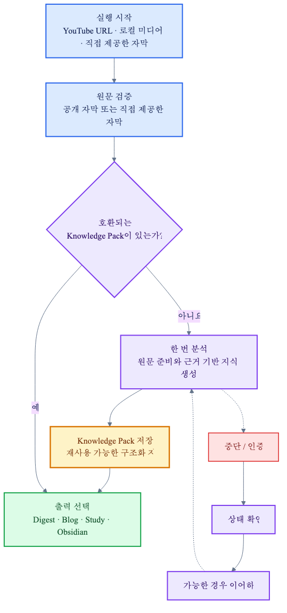
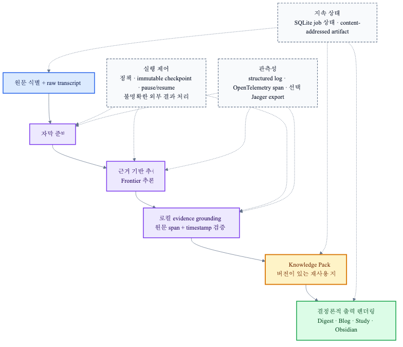

# YouTube Summarizer Kit (`chew`)

[](https://github.com/SHcommit/youtube-summerizer-kit/actions/workflows/ci.yml)
[](https://www.python.org/downloads/)
[](LICENSE)

[English](README.md) | **한국어**

YouTube 영상과 로컬 오디오·영상 파일을 재사용 가능한 지식으로 변환하는 로컬 중심 CLI(`chew`)입니다.
일회성 요약을 출력하는 대신 자막을 검증하고, 장·소주제를 병렬 분석하여 다양한 포맷 문서로 조립합니다.

- `chew <URL>` 명령으로 실행합니다.
- 챕터를 인식하고 소주제 단위로 병렬 처리하여 긴 영상도 안정적으로 분석합니다.
- 중간에 네트워크나 AI CLI가 끊겨도 완료된 작업부터 이어합니다.
- 같은 URL과 분석 설정은 run-id 없이도 기존 Knowledge Pack을 재사용합니다.
- 직접 지정한 로컬 미디어는 원본 위치에서 음성 인식하고, 파일을 옮기거나 이름을 바꿔도 콘텐츠 해시로 기존 분석을 재사용합니다.
- Codex CLI, Gemini CLI, Claude Code / Claude CLI, Ollama, Antigravity CLI(`agy`)를 공통 Harness 인터페이스로 연결합니다.
- 블로그 문체와 학습 방식은 긴 CLI 옵션 대신 Markdown 파일로 관리합니다.

## 왜 `chew`인가?

1~2시간짜리 유명 기술 발표, 팟캐스트, 강의 영상을 볼 시간은 부족하고, 기존 AI 요약 도구는 무성의한 5줄 요약만 내놓아 핵심 기술 맥락과 타임스탬프 근거를 모두 잃어버립니다.

`chew`는 이 문제를 해결하기 위해 만들어졌습니다:

- **영상 보지 말고, AI가 씹어 삼켜드립니다 (Don't watch, let AI chew it)**: 긴 미디어를 장·소주제 단위로 쪼개어 AI가 깊이 있게 분석(Chew)하고 구조화합니다.
- **한 번 분석(Analyze Once), 어디서나 재조립**: 영상 1개를 **Knowledge Pack**으로 한 번만 분석해 두면, LLM 재호출이나 비싼 API 비용 없이 1초 만에 기술 블로그, 학습 노트, 옵시디언 위키노트로 목적에 맞춰 즉시 재조립합니다.
- **내 로컬 AI 세션 그대로**: API 키 발급이나 구독료 없이, 내 컴퓨터에 이미 설치된 Codex, Gemini, Claude, Ollama, Antigravity CLI 세션을 그대로 활용합니다.

> 현재는 자막 중심 분석입니다. 화면에만 나타나는 도표·코드·장면이 핵심인 영상은 정보가 빠질 수 있으며, 프레임 기반 멀티모달 분석은 아직 기본 파이프라인에 포함되지 않습니다.

## 현재 지원 상태

| 실행기 | 사용 가능 | 로그인 확인 | 로그인/실행 방법 |
|---|---|---|---|
| Codex CLI (`codex`) | 예 | `codex login status`로 사전 확인 | 필요하면 `codex login` |
| Claude Code / Claude CLI (`claude`) | 예 | `claude auth status`로 사전 확인 | 필요하면 `claude`에서 로그인 |
| Gemini CLI (`gemini`) | 예 | 공식 비소모성 상태 명령이 없어 첫 생성 때 확인 | 필요하면 `gemini`에서 로그인 |
| Ollama (`ollama`) | 예 | 로그인 불필요 | 로컬 Ollama 서버 실행 |
| Antigravity CLI / AGY (`agy`) | 예 | 첫 생성 때 확인 / 기존 로컬 세션 사용 | `agy` CLI 설치 및 세션 사용 |

기본값 `runtime: auto`에서는 설치되어 있고 로그인이 확인된 실행기를 Codex → Gemini → Claude → Ollama → Antigravity 순서의 후보군에서 선택합니다. 로그인 여부를 사전에 확정할 수 없는 Gemini는 확인된 실행기가 하나도 없을 때 후보가 되고, 첫 생성 요청에서 실제 인증을 검증합니다.

Codex나 Claude처럼 인증 상태를 확인할 수 있는 실행기가 로그아웃 상태라면 다른 준비된 실행기로 넘어갑니다. 특정 실행기를 설정으로 고정했는데 로그인되어 있지 않다면 로그인 명령을 안내하고 실행을 `blocked_auth` 상태로 보존합니다. 로그인 후 `chew 이어하기`를 실행하면 완료된 구간을 다시 처리하지 않고 계속합니다.

이 프로젝트는 사용자의 인증 파일이나 API 키를 직접 읽거나 복사하지 않습니다. 설치된 CLI를 별도 프로세스로 실행하므로 기존 Codex·Gemini·Claude 로그인 세션을 그대로 사용합니다.

## 아키텍처

이 프로젝트는 **포트와 어댑터(Ports & Adapters / 육각형 아키텍처)** 모듈 구조를 따릅니다. 상세 지침은 [`AGENTS.md`](AGENTS.md)를 참고하세요.

```
src/chew/
├── core/         # Layer 1: 도메인 엔티티, SHA-256 식별자, 프롬프트
├── pipeline/     # Layer 2: 계층적 분석 파이프라인, DAG 스케줄러, 출력 생성기
├── storage/      # Layer 3: SQLite WAL 상태 머신 및 zstd 아티팩트 저장소
├── harness/      # Layer 4: AI 런타임 연결 어댑터 (Codex, Gemini, Claude, Ollama, Antigravity)
├── transcripts/  # Layer 5: 자막 수집 및 음성 인식 어댑터 (YouTube API, yt-dlp, Whisper)
├── app/          # Layer 6: 응용 오케스트레이션 서비스 및 DI 컨테이너
├── retention/    # Layer 7: 저장 보존 및 정리 정책
├── benchmark/    # Layer 8: 품질 평가 벤치마크 프레임워크
└── cli/          # Layer 9: 이중 언어(한/영) Typer CLI 커맨드
```

## 빠른 시작 및 설치 (Installation & Quick Start)

`chew` 명령어를 실행하기 전 **최초 1회 설치 및 설정 초기화**가 필요합니다. Python 3.12 이상이 필요합니다. 아래 **1-Click 자동 설치 스크립트**를 실행하면 1초 만에 의존성 설치, 전역 `chew` 명령어 등록, 그리고 기본 설정 파일(`CHEW.md` 및 `.chew/profiles/`) 초기화가 완료됩니다:

```bash
git clone https://github.com/SHcommit/youtube-summerizer-kit.git
cd youtube-summarizer-kit

# 1초 자동 설치, chew 명령어 전역 등록, CHEW.md & .chew/profiles/ 자동 초기화
./setup.sh
```

설치 후에는 터미널에서 **`chew 'URL'`**만 입력하여 즉시 실행할 수 있습니다:

```bash
# 기본 상세 요약 실행 (완료 시 파이썬 프로세스 자동 종료 및 마크다운 파일 저장)
chew 'https://www.youtube.com/watch?v=VIDEO_ID'

# 내용이 꽉 차는 깊은 심층 요약 실행
chew 'https://www.youtube.com/watch?v=VIDEO_ID' --depth deep

# 빠른 초간단 요약 실행 (quick / short / brief)
chew 'https://www.youtube.com/watch?v=VIDEO_ID' --depth quick

# 분석 완료된 기존 영상 목적별 문서 1초 재조립
chew 블로그 'https://www.youtube.com/watch?v=VIDEO_ID'
chew 학습 'https://www.youtube.com/watch?v=VIDEO_ID'
chew 옵시디언 'https://www.youtube.com/watch?v=VIDEO_ID'

# 로컬 미디어 녹음 파일 요약
chew 요약 ./recordings/meeting.mp3
```

개발 도구까지 포함한 수동 설치 방법:

```bash
pip install -e '.[youtube,dev]'
```

선택적 `faster-whisper` fallback은 모델과 영상 오디오를 자동으로 내려받지 않도록 기본값이 비활성화되어 있습니다. 사용하려면 `pip install -e '.[youtube,whisper]'`로 설치하고 `CHEW.md`에 `whisper_fallback: true`를 지정합니다. 처음 실제로 음성 인식을 실행할 때는 `faster-whisper`가 모델을 내려받을 수 있습니다.

로컬 오디오·영상 파일 입력에도 `whisper` extra가 필요하지만, YouTube fallback 설정을 켤 필요는 없습니다.

```bash
pip install -e '.[youtube,whisper]'
```

설치 후 환경 점검:

```bash
chew 진단
chew 진단 --json
```

## 자막이 없는 영상

일반 경로에서는 영상 미디어를 내려받지 않고 이미 존재하는 텍스트를 수집합니다. 수동 자막, 자동 생성 자막, `youtube-transcript-api` 순서로 시도하며, 셋 모두 사용할 수 없거나 품질 검사를 통과하지 못하면 모델이나 오디오를 몰래 내려받지 않고 로컬 음성 인식 활성화 방법을 안내합니다.

선택적 의존성을 설치하고 `CHEW.md`에서 fallback을 활성화합니다.

```bash
pip install -e '.[youtube,whisper]'
```

```markdown
---
whisper_fallback: true
---
```

이 설정을 켜면 네 번째 fallback이 영상 오디오를 임시 디렉터리에 내려받고 `faster-whisper`로 타임스탬프가 있는 transcript를 로컬에서 새로 만듭니다. 음성 인식이 끝나면 임시 오디오는 삭제됩니다. 최초 실행에는 Whisper 모델 다운로드가 발생할 수 있고 로컬 CPU/GPU 시간을 사용하지만, AI CLI 로그인이나 hosted API quota는 소비하지 않습니다. 앞서 yt-dlp로 확인한 영상 제목과 챕터도 유지됩니다. 정확도는 음질, 화자, 설정한 자막 언어에 따라 달라질 수 있습니다.

## 로컬 오디오·영상 파일

YouTube URL을 받는 자리에 기존 로컬 미디어 경로를 넣을 수 있습니다. 경로를 직접 제공한 것 자체가 해당 파일의 음성 인식을 명시적으로 요청한 것이므로 `whisper_fallback`은 `false`여도 됩니다. `faster-whisper`가 원본 파일을 그 위치에서 바로 읽으며, 원본을 복사·수정·삭제하지 않습니다. HTTP 미디어 URL은 로컬 입력으로 받지 않습니다.

```bash
chew 요약 ./recordings/meeting.mp3
chew 학습 ./lectures/week-01.mp4

# URL이나 지원하는 로컬 경로는 `요약` 없이 바로 줄 수도 있음
chew ./recordings/interview.m4a
```

지원 확장자는 AAC, FLAC, M4A, MKV, MOV, MP3, MP4, MPEG/MPG, OGA/OGG, OPUS, WAV, WebM입니다. 파일 내용의 SHA-256으로 입력을 식별하므로 같은 파일을 옮기거나 이름을 바꿔도 호환되는 Knowledge Pack을 재사용합니다. 중단된 실행은 `chew 이어하기`를 위해 절대 경로를 저장하므로 분석이 끝날 때까지는 해당 경로에 파일을 유지해야 합니다. 첫 음성 인식 때 설정한 Whisper 모델을 내려받을 수 있고 로컬 CPU/GPU 시간을 사용하지만, hosted 음성 인식 quota는 쓰지 않습니다.

## CLI 명령어 요약

| 한국어 명령 | 영어 별칭 | 역할 |
|---|---|---|
| `요약` | `summarize` | 전체 요약과 챕터·소주제별 핵심 정리 |
| `블로그` | `blog` | 지정한 블로그 문체로 재구성 |
| `학습` | `study` | 개념, 근거, 추가 학습 항목 중심으로 재구성 |
| `옵시디언` | `obsidian` | `[[위키링크]]`가 있는 인덱스와 소주제 노트 생성 |
| `상태 [RUN_ID]` | `status` | 실행 및 작업 진행률 확인 |
| `이어하기 [RUN_ID]` | `resume` | 최신 또는 지정한 미완료 실행 재개 |
| `진단` | `doctor` | 실행기 설치·인증·지원 기능 확인 |
| `저장소` | `storage` | 내부 파일 수와 용량 확인 |
| `정리` | `cleanup` | 보존 정책에 따른 삭제 후보 미리보기·적용 |

입력을 생략하면 YouTube URL 또는 로컬 미디어 경로를 대화형으로 묻습니다. 자동화에서는 `--json`을 붙이면 `{"ok": true, "data": ...}` 형식으로 실행 결과를 받을 수 있습니다.

## Markdown 설정과 출력 문체

프로젝트에서 한 번만 초기화합니다.

```bash
chew 설정 --초기화
```

다음 파일이 생성되며 기존 파일은 덮어쓰지 않습니다.

```text
CHEW.md
.chew/
└── profiles/
    ├── blog.md
    ├── study.md
    └── obsidian.md
```

`CHEW.md` 예시:

```markdown
---
language: ko
default_profile: digest
depth: detailed
runtime: auto
whisper_fallback: false
storage_policy: compact
---

사실과 AI의 추가 설명을 구분한다.
기술 용어는 첫 등장에 짧게 정의하고, 모든 핵심 주장에 영상 근거를 연결한다.
```

### 요약 강도 및 깊이 설정 (`depth`)

CLI 옵션(`--depth` / `--요약강도` / `-d`) 또는 `CHEW.md` 파일에서 3단계 요약 강도를 자유롭게 선택할 수 있습니다:

- **`quick` (`short` / `brief` / `초간단` / `핵심`)**: 핵심 주요 마일스톤 위주의 빠른 훑어보기용 초간단 요약
- **`detailed` (`상세`, 기본값)**: 챕터별 주요 소주제와 근거 타임스탬프를 포함한 균형 잡힌 상세 요약
- **`deep` (`심층` / `꽉찬`)**: 영상의 모든 챕터, 디테일, 기술적 맥락과 세부 쟁점을 꽉 채운 깊은 심층 분석 요약

```bash
# 빠른 초간단 핵심 요약 (quick / short / brief 모두 사용 가능)
chew '유튜브_URL' --depth quick

# 내용이 꽉 차는 깊은 심층 요약
chew '유튜브_URL' --depth deep
```

본문은 LLM 지침으로 사용됩니다. `.chew/profiles/blog.md` 같은 목적별 파일에서는 문체, 독자 수준, 글의 구성 방식을 추가로 지정할 수 있습니다. 프로젝트 설정은 상위 디렉터리까지 탐색하며, 파일이 없으면 패키지에 포함된 안전한 기본 설정을 사용합니다.

분석 설정과 출력 설정은 분리됩니다. 예를 들어 블로그 문체만 바꿨다면 자막과 소주제를 다시 분석하지 않고 기존 Knowledge Pack에서 블로그 문서만 새로 만듭니다. 프로필별로 다른 `runtime`을 지정하면 캐시되지 않은 출력 재조립에 그 실행기를 사용합니다.

## 사용자 입력과 출력

첫 번째 다이어그램은 내부 구현을 숨기고, 사용자가 무엇을 넣고 무엇을 받는지만 보여줍니다.



같은 URL과 분석 설정의 Knowledge Pack이 이미 있으면 영상 분석을 반복하지 않습니다. 문체나 출력 목적만 바뀌면 기존 Knowledge Pack을 블로그·학습 노트·Obsidian 문서로 재조립합니다.

## 내부 상세 처리 흐름 (How It Works)

두 번째 다이어그램은 위에서 아래로 `INPUT → 분석 → Knowledge Pack → 재조립 → OUTPUT`을 따라갑니다. AI 실행기, 저장소, 인증 복구는 메인 흐름을 지원하는 별도 계층으로 표시합니다.



노란색 Knowledge Pack이 재사용의 중심입니다. 한 번 생성되면 자막·소주제 분석을 반복하지 않고 목적과 문체를 바꿔 새 출력으로 조립할 수 있습니다. 점선 저장 계층은 각 단계의 상태와 결과를 보존하고, 빨간색 복구 흐름은 인증이나 연결 문제 이후 어디서 다시 시작하는지 보여줍니다.

### 1. 입력 식별자와 재사용 키
`youtu.be`, `youtube.com/watch`, Shorts, 모바일 URL을 하나의 canonical URL과 `youtube:<video-id>`로 통일합니다. 로컬 미디어는 이름이나 경로가 아닌 파일 바이트의 SHA-256에서 `local:<sha256>` 식별자를 만듭니다. 언어, 분석 깊이, 실행기 정책, 공통 지침, 프롬프트·분할·스키마 버전도 fingerprint에 넣어 호환되는 결과만 재사용합니다.

### 2. 메타데이터와 자막
기본 fallback 순서는 다음과 같습니다:
1. yt-dlp 수동 자막
2. yt-dlp 자동 생성 자막
3. `youtube-transcript-api`
4. `whisper_fallback: true`일 때만 `faster-whisper`

사용자가 명시적으로 준 로컬 미디어 파일은 YouTube provider를 거치지 않고 `faster-whisper`로 바로 넘어갑니다. fallback 설정은 YouTube 오디오 자동 다운로드만 제어합니다. 자막은 언어, 시간 순서, 전체 길이 대비 coverage, 과도한 반복, 큰 무음 구간을 검사합니다. 한 provider가 실패하거나 품질 기준을 통과하지 못하면 이유를 기록하고 다음 provider로 넘어갑니다.

### 3. 적응형 분할과 병렬 처리
YouTube 챕터가 있으면 먼저 챕터 경계를 유지합니다. 챕터가 너무 길거나 챕터가 없으면 문장 경계를 존중하면서 약 5~10분 크기의 소주제로 나눕니다. 서로 독립적인 소주제는 비동기 큐에서 병렬 처리하고, 필요한 소주제가 끝난 챕터는 다른 챕터를 기다리지 않고 바로 병합합니다. 전역 동시 실행 수와 실행기별 제한을 함께 적용합니다. rate limit이 발생하면 해당 실행기의 동시성을 줄이고 재시도하며, 성공이 이어지면 제한을 점진적으로 회복합니다.

### 4. 계층형 요약과 Knowledge Pack
```text
Transcript
  → TopicSummary[]
  → ChapterSummary[]
  → KnowledgePack
  → 목적별 문서
```
Knowledge Pack에는 영상 식별자·제목·언어·전체 개요뿐 아니라 소주제와 챕터, 핵심 주장, 타임스탬프가 있는 근거, 개념·예시·추가 학습 항목, 분석 fingerprint가 들어갑니다. 영상에서 확인된 내용과 AI 추가 설명·외부 연구의 provenance를 분리할 수 있는 도메인 모델을 사용합니다.

### 5. 출력 재조립
- `digest`: LLM 추가 호출 없이 전체·챕터·소주제 요약과 근거 타임스탬프를 Markdown으로 생성
- `blog`: Knowledge Pack을 바탕으로 개요 작성 → 본문 작성 → 검증의 세 단계로 재조립
- `study`: 학습용 구조와 추가 학습 항목 중심으로 재조립
- `obsidian`: 인덱스와 소주제별 파일을 만들고 `[[링크]]`로 연결

출력 자체도 Knowledge Pack fingerprint, 프로필, 지침, 언어, 깊이, 실행기, 출력 recipe 버전으로 캐시합니다. 동일한 출력 요청은 로그인된 AI CLI가 없어도 로컬 캐시만으로 복원할 수 있습니다.

## 성능 개선 (Performance Boost)

기존 파이프라인의 30분 지연 병목 현상을 해결하여 **16.3배 성능 향상**을 달성했습니다:

| 항목 | 개선 전 (Baseline) | 개선 후 (Optimized) | 향상률 |
|---|---|---|---|
| 25분 기술 영상 분석 시간 | 30분 00초 (1,800s) | **1분 50초 (110s)** | **16.3배 단축** |
| 파이프라인 생성 작업 수 | 61개 미세 태스크 | **11개 응축 태스크** | 82% 감소 |
| AI Harness 동시성 수 | 2개 제한 | **8개 병렬 처리** | 4배 확대 |

상세 분석 보고서: [`reports/performance_analysis.md`](reports/performance_analysis.md)

## 주요 모듈

| 모듈 | 책임 |
|---|---|
| `application.py` | CLI와 분석·출력·재개의 use case 연결 |
| `transcripts/` | 자막 provider fallback, 정규화, 품질 검증 |
| `segmentation.py` | 챕터 우선·시간 기반 소주제 분할 |
| `scheduler.py` | 의존성 DAG, 병렬 실행, lease, heartbeat, 재시도 |
| `harness/` | 외부 AI CLI 탐색, 인증 진단, 구조화 출력 변환 |
| `pipeline.py` | 소주제 → 챕터 → Knowledge Pack 계층형 합성 |
| `outputs.py` | digest·blog·study·Obsidian 재조립과 출력 캐시 |
| `storage/` | SQLite 상태 저장과 content-addressed artifact 저장 |
| `retention.py` | 미리보기 기반 보존·삭제 정책 |
| `benchmark.py` | Gemini 직접 분석과 계층형 파이프라인 비교 |

핵심 파이프라인은 특정 업체 SDK나 계정 파일을 알지 못합니다. 모든 AI 요청은 `GenerationRequest → Harness → GenerationResult` 계약을 통과하므로 새 실행기를 추가할 때 파이프라인을 수정하지 않고 어댑터만 구현할 수 있습니다.

## 중단 복구와 캐시

SQLite WAL에 run, job, 의존성, 시도 횟수, worker claim, lease 만료 시각을 기록합니다. 각 작업은 고유 claim token을 가져 오래된 worker가 새 결과를 덮어쓰지 못합니다. 실행 중에는 heartbeat로 lease를 연장하고, 프로세스 종료나 네트워크 단절로 lease가 만료되면 다시 큐에 넣습니다.

```bash
chew 상태
chew 상태 RUN_ID
chew 이어하기
chew 이어하기 RUN_ID
```

재개할 때는 현재 설정이 아니라 최초 run에 저장된 분석 recipe를 사용합니다. URL만 다시 입력해도 동일한 분석이 완료되어 있다면 run-id 없이 Knowledge Pack을 찾아 재조립합니다. 불변 transcript·요약·Knowledge Pack·출력 캐시는 canonical JSON의 SHA-256 digest를 주소로 사용하고 zstd로 압축합니다. 같은 내용은 한 번만 저장됩니다. 기본 데이터 위치는 운영체제의 사용자 application-data 디렉터리이며, 사용자가 지정한 출력 폴더는 자동 정리하지 않습니다.

## 저장 및 삭제 정책

- `compact`(기본): 참조 중인 자료를 보호하고 24시간 지난 임시 미디어, 30일 지난 로그, 7일 지난 미참조 객체를 정리합니다.
- `private`: 내보낸 파일이 실제로 존재하는지 확인한 뒤 관련 내부 자막과 중간 산출물을 정리할 수 있습니다.
- `archive`: 분석 리비전과 중간 자료를 계속 보존합니다.

```bash
chew 저장소
chew 정리 --policy compact        # 미리보기
chew 정리 --policy compact --apply
chew 삭제 RUN_ID                  # 확인 후 특정 실행 삭제
chew 완전삭제                      # 별도 확인 문구 필요
```

`정리`는 기본적으로 미리보기만 수행합니다. 명시적 `--apply` 또는 사용자 확인 없이는 내부 자료를 삭제하지 않습니다.

## 벤치마크 & OpenTelemetry 시각화 대시보드

성능 프로파일링 및 관측성을 위한 선택적 기능입니다. 일반 사용자에게는 불필요하며, 벤치마킹을 원하는 개발자만 선택하여 실행합니다:

```bash
# 선택적 벤치마킹 및 대시보드 패키지 설치
pip install -e '.[telemetry]'

# OpenTelemetry 기반 실시간 대시보드 UI 구동
chew benchmark-dashboard
# 또는
chew benchmark-ui
```

```bash
chew 벤치마크 목록
chew 벤치마크 실행 'https://youtu.be/VIDEO_ID' --live \
  --reference benchmark-reference.json --repeats 3 --runtime codex
```

비교 조건은 Gemini 직접 URL 분석(단순 프롬프트·동일 스키마)과 계층형 파이프라인(Gemini·설정 실행기)입니다. 기준 답안의 주장·근거·타임스탬프와 비교해 recall, 근거 coverage, timestamp accuracy, 장시간 구간 coverage, unsupported claim을 계산합니다. 입력 방식이 `video_url`인지 `transcript`인지 분리 표기하여 Gemini의 멀티모달 이점을 파이프라인 품질로 오인하지 않습니다.

라이브 벤치마크는 실제 로그인과 사용량이 발생하므로 `--live`와 기준 답안 파일을 모두 명시해야 실행됩니다. 결과는 `benchmark-results/run-*/report.json`과 `report.md`에 원자적으로 저장됩니다. 아직 실제 다국어·다양한 길이의 공개 코퍼스 결과를 제공하거나 Gemini보다 항상 우수하다고 주장하지 않습니다.

## 개발과 검증

```bash
# 1초 자동 설치 및 chew 터미널 명령어 등록
./setup.sh

# 개별 검증
pip install -e '.[youtube,dev]'
ruff check .
mypy src/chew
pytest -q
coverage run -m pytest
coverage report
python -m build
```

기본 테스트와 벤치마크 목록은 외부 호출을 하지 않습니다. 라이브 검증은 다음 환경 변수를 명시했을 때만 실행됩니다.
- `YTSUM_LIVE_YOUTUBE_URL`: 실제 자막 provider 통합 테스트
- `YTSUM_LIVE_HARNESS`: `codex`, `gemini`, `claude`, `ollama` 중 하나의 실행기 테스트

자세한 개발 및 테스트 지침은 [CONTRIBUTING.md](CONTRIBUTING.md)를 참고하세요.

## 버전 이력

버전별 변경 사항 및 릴리스 노트는 [CHANGELOG.md](CHANGELOG.md)에서 자세히 확인할 수 있습니다.
