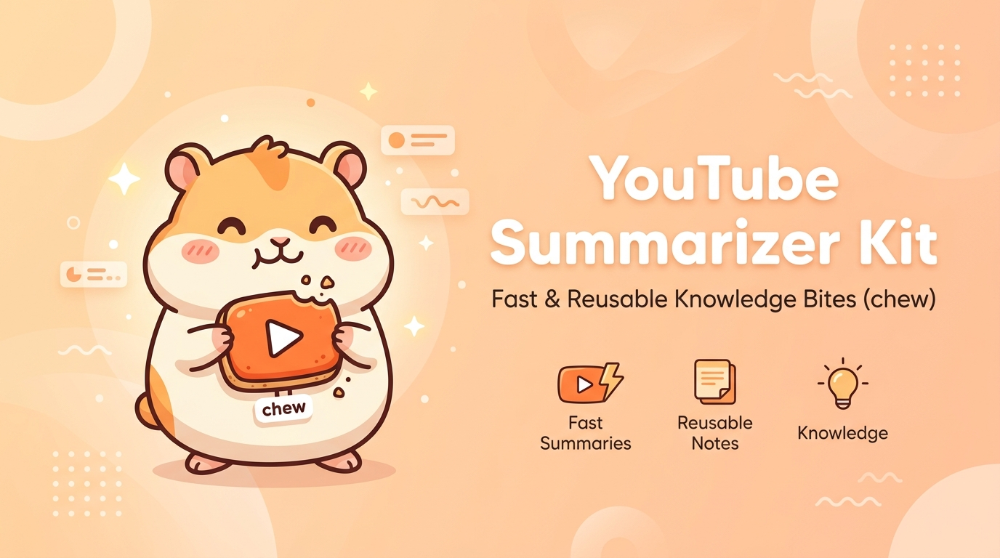
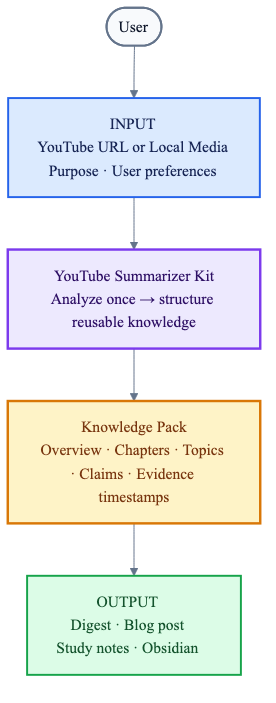
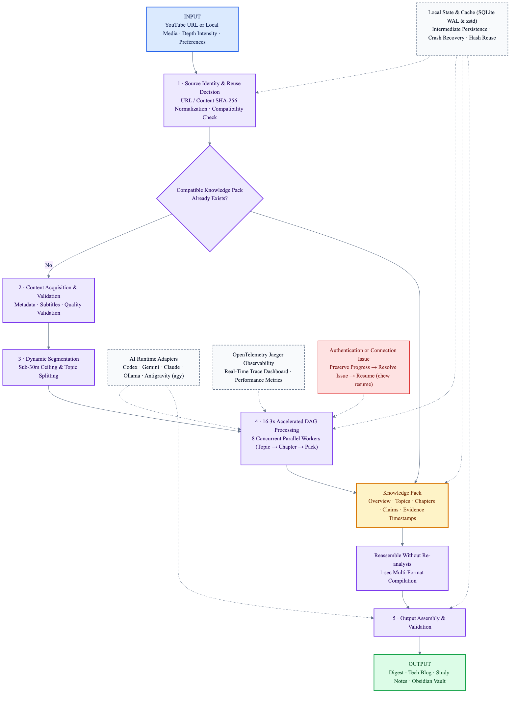
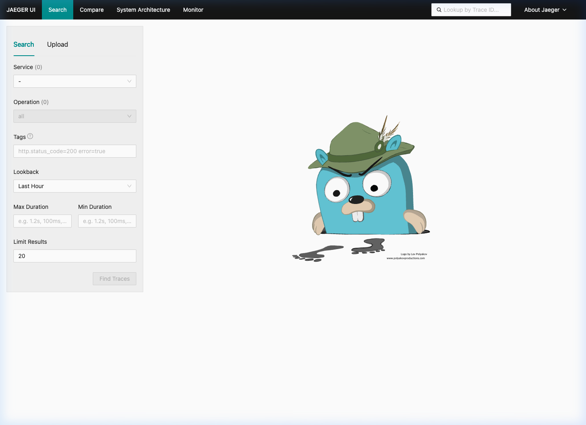

# YouTube Summarizer Kit (`chew`)

[](https://github.com/SHcommit/youtube-summerizer-kit/actions/workflows/ci.yml)
[](https://www.python.org/downloads/)
[](LICENSE)

**English** | [한국어](README.ko.md)



A local-first, resumable CLI (`chew`) that turns YouTube videos and local audio or video files into reusable knowledge. It validates transcripts, analyzes chapters and topics in parallel, and compiles the result into multiple formats instead of producing a one-off summary.

- Run with `chew <URL>`.
- Handles long videos with chapter-aware, topic-level parallel processing.
- Resumes from completed work after a network or AI CLI interruption.
- Reuses an existing Knowledge Pack for the same URL and analysis settings—no run ID required.
- Transcribes explicitly supplied local media in place and reuses it by content hash, even if the file is moved or renamed.
- Connects Codex CLI, Gemini CLI, Claude Code / Claude CLI, Ollama, and Antigravity CLI (`agy`) through one harness interface.
- Stores writing tone and study preferences in Markdown instead of long CLI option lists.

---

## Why `chew`?

Modern technical talks, podcasts, and video lectures are 1–2 hours long, yet traditional AI summarizers only produce superficial 5-bullet-point summaries that strip away key code context, evidence timestamps, and technical depth.

`chew` was built to solve this exact problem:

- **Don't watch. Let AI chew it for you**: Breaks long videos into topic-level segments so AI can digest and extract deep, timestamp-verified knowledge.
- **Analyze Once, Reassemble Anywhere**: Analyzes a video **once** into a content-addressed **Knowledge Pack**. Reassemble it instantly into Tech Blogs, Study Notes, or Obsidian Vaults without re-running expensive LLM calls.
- **Local-First & Multi-LLM Harness**: Leverages your existing Codex, Gemini, Claude, Ollama, or Antigravity CLI logins directly from your local terminal—no API keys required.

> The current pipeline is transcript-first. Videos whose essential information appears only in diagrams, code shown on screen, or visual scenes may lose context. Frame-based multimodal analysis is not yet part of the default pipeline.

---

## Download & Installation (Prerequisites Required First)

Before running the `chew` CLI command in your terminal, you **must complete the download and environment setup below first**. Python 3.12 or newer is required. Choose your preferred package manager or installation method below:

### Package Manager 1-Line Installation (Recommended)

```bash
# Homebrew installation (macOS / Linux recommended)
brew install SHcommit/tap/chew

# pipx isolated global installation
pipx install youtube-summarizer-kit

# uv high-speed global CLI installation
uv tool install youtube-summarizer-kit

# Standard pip installation
pip install youtube-summarizer-kit
```

### Source Repository Clone & 1-Click Auto Setup

Run the **1-Click Auto Setup** below to clone the repository, install dependencies, register the global `chew` command, and initialize configuration files (`CHEW.md` and `.chew/profiles/`) automatically in 1 second:

```bash
# 1. Clone the repository (Download)
git clone https://github.com/SHcommit/youtube-summerizer-kit.git
cd youtube-summarizer-kit

# 2. 1-Click Auto Installer (registers global 'chew' command, initializes CHEW.md & .chew/profiles/)
./setup.sh
```

After installation, simply run **`chew 'URL'`** directly from your terminal:

```bash
# Detailed digest (automatically terminates Python process and saves Markdown upon completion)
chew 'https://www.youtube.com/watch?v=VIDEO_ID'

# Comprehensive deep-dive summary
chew 'https://www.youtube.com/watch?v=VIDEO_ID' --depth deep

# Quick high-level summary (quick / short / brief)
chew 'https://www.youtube.com/watch?v=VIDEO_ID' --depth quick

# Purpose-specific reassembly (reuses Knowledge Pack instantly)
chew blog 'https://www.youtube.com/watch?v=VIDEO_ID'
chew study 'https://www.youtube.com/watch?v=VIDEO_ID'
chew obsidian 'https://www.youtube.com/watch?v=VIDEO_ID'

# Local recording file
chew summarize ./recordings/meeting.mp3
```

Manual installation with developer dependencies:

```bash
pip install -e '.[youtube,dev]'
```

The optional `faster-whisper` fallback is disabled by default so installation does not download a speech model or video audio. To enable it, install `pip install -e '.[youtube,whisper]'` and set `whisper_fallback: true` in `CHEW.md`. The first enabled transcription may download a model through `faster-whisper`.

For a YouTube `HTTP 429` timed-text response, `yt-dlp` automatically enables an installed Node.js runtime and its official EJS challenge component. If it persists, explicitly connect your own local YouTube session:

```bash
chew auth youtube --from-browser chrome
chew summarize "https://www.youtube.com/watch?v=VIDEO_ID"
chew auth youtube --clear
```

Login is optional. `chew` accesses only the selected local browser when this command is invoked, retains only YouTube-domain cookies in private local storage, and never uses a proxy or remote `chew` server. YouTube can still deny unavailable, restricted, or account-limited captions. Advanced users may instead set a YouTube-only Netscape `cookies.txt` path with `youtube_cookie_file: ./youtube-cookies.txt` in `CHEW.md`.

Local audio and video file input also requires the `whisper` extra:

```bash
pip install -e '.[youtube,whisper]'
```

Check the environment after installation:

```bash
chew doctor
chew doctor --json
```

---

## User Flow & Visualization Diagrams (Demo & Diagrams)

### User Input and Output

This overview shows the public contract: what users provide and what the kit returns.



When a compatible Knowledge Pack already exists for the URL and analysis settings, the kit skips video analysis. A different purpose or voice reassembles that pack into a blog post, study guide, or Obsidian vault.

### Internal Processing Flow Diagram

The detailed diagram follows `INPUT → analysis → Knowledge Pack → reassembly → OUTPUT`. Runtime adapters, persistent local state, and recovery support the main path without defining it.



The yellow Knowledge Pack is the reuse boundary. Once created, the system can produce a new output without repeating transcript and topic analysis. Dashed support nodes preserve intermediate state and show where processing resumes after authentication or connectivity problems.

### OpenTelemetry Jaeger Real-Time Trace Observability



---

## Runtime Support

| Runtime | Available | Authentication check | Setup |
|---|---:|---|---|
| Codex CLI (`codex`) | Yes | Preflight check with `codex login status` | Run `codex login` if needed |
| Claude Code / Claude CLI (`claude`) | Yes | Preflight check with `claude auth status` | Sign in through `claude` if needed |
| Gemini CLI (`gemini`) | Yes | Verified on the first generation request | Sign in through `gemini` if needed |
| Ollama (`ollama`) | Yes | No login required | Start a local Ollama server |
| Layered Ollama (`layered_ollama`) | Yes | No login required | Start Ollama with 1.5B / 7B / 14B model tiers (`qwen2.5:*-instruct-q4_K_M`) |
| HuggingFace (`huggingface`) | Yes | `HF_TOKEN` env var | Set `HF_TOKEN`; `pip install 'chew[huggingface]'` |
| Antigravity CLI / AGY (`agy`) | Yes | Verified on invocation / persistent session | Install `agy` CLI |

**Local LLMs are completely optional.** The default `runtime: frontier` selects an authenticated Codex, Gemini, or Claude runtime and excludes local models. Final summaries and judgments require a Frontier runtime; local models are not valid summary task routes.

Ollama is the only optional runtime that requires a local model download:

| Setup | Disk required |
|---|---|
| Codex / Gemini / Claude / Antigravity / HuggingFace | 0 GB extra |
| `ollama` with a single model | ~1–5 GB |
| `layered_ollama` with all three tiers | ~15 GB total (`q4_K_M` quantized) |

Run `chew doctor` to see which runtimes are available on your machine and get install hints for any that are missing.

Because Gemini does not expose a reliable non-consuming authentication-status command, it is probed by the first actual generation request when no already-verified runtime is available.

If a runtime with a preflight authentication check is signed out, automatic selection moves to another ready runtime. If you explicitly select a signed-out runtime, the run is saved as `blocked_auth` and the CLI prints the login command. Sign in, then run `chew resume`; completed segments are preserved.

The kit never reads or copies account files or API keys. It launches installed AI CLIs as child processes and uses their existing Codex, Gemini, or Claude login sessions.

---

## Markdown Configuration and Writing Style

Initialize editable configuration once per project:

```bash
chew config --init
```

In an interactive terminal, this first-run command offers a local-model choice: Qwen3 4B (about 2.5GB), Qwen3 8B (about 5.2GB), or configure later. It only runs `ollama pull` after explicit confirmation.

The command creates these files without overwriting existing ones:

```text
CHEW.md
.chew/
└── profiles/
    ├── blog.md
    ├── study.md
    └── obsidian.md
```

Example `CHEW.md`:

```markdown
---
language: en
default_profile: digest
depth: detailed
runtime: frontier
task_runtimes: {} # Optional BYOK Frontier routing, e.g. {topic_summary: gemini, compose: codex}
local_accelerator: false # Reserved for a future approved low-risk helper task
ollama_model: null # Reserved for a future approved local helper task
whisper_fallback: false
youtube_cookie_file: null # Advanced override: explicit YouTube-only cookies.txt path
# Optional Ollama input ceiling. Leave unset to retain time-only segmentation.
max_input_tokens: 4096
reserved_output_tokens: 512
output_verify: true
normalize_transcript: false
preprocess_transcript: false
storage_policy: compact
---

Separate claims from the video from additional AI explanations.
Define technical terms on first use and connect every important claim to video evidence.
```

### Summary Depth Intensity (`depth`)

Customize the summary detail level via CLI flag (`--depth` / `-d`) or inside `CHEW.md`:

- **`quick`** (`short` / `brief`): High-level key milestone summary for fast scanning
- **`detailed`** (default): Balanced detailed summary with chapter subtopics and timestamp evidence
- **`deep`**: Comprehensive deep-dive analysis capturing every chapter, technical detail, and argument

```bash
# Quick high-level summary (quick / short / brief)
chew 'VIDEO_URL' --depth quick

# Comprehensive deep-dive summary
chew 'VIDEO_URL' --depth deep
```

The Markdown body becomes an LLM instruction. Purpose-specific files such as `.chew/profiles/blog.md` can define voice, audience level, and document structure. Configuration discovery walks up through parent directories; packaged defaults are used when no file exists.

Analysis settings and output settings are fingerprinted separately. Changing only the blog voice does not repeat transcript and topic analysis—it generates a new document from the existing Knowledge Pack. A profile may also choose a different `runtime` for uncached output reassembly.

`max_input_tokens` and `reserved_output_tokens` opt in to a conservative input ceiling. They are not provider billing figures; leave both unset to preserve the default time-based segmentation.

For `blog` and `study`, `output_verify: false` skips the final LLM verification call. Keep the default enabled until fixture measurements show that the cost saving does not reduce output quality.

`normalize_transcript: true` only normalizes whitespace and collapses adjacent duplicate captions. The raw transcript remains the evidence source and is retained separately.

`preprocess_transcript: true` additionally applies conservative local filler removal. With `pip install 'chew[preprocess]'`, punctuation restoration and semantic boundary hints are added when their optional dependencies are present. This is opt-in until the locked fixture comparison confirms the quality and cost tradeoff.

`task_runtimes` is opt-in BYOK Frontier routing. Each run first records an immutable Execution Plan with its route, input budget, fallback, and reason. Tasks omitted from the map keep `runtime`; model output cannot change that plan. Local runtimes cannot be selected for summary or judgment work. Cloud model selectors are not accepted until each adapter can apply and verify them.

Important source claims carry model-proposed citations only after their segment index, timestamp, and quoted text match the immutable raw transcript. Citation validation anchors a claim in the source; it does not independently establish that the claim is true.

The current locked English fixture comparison found only `1.92%–4.94%` `cl100k_base` reduction from conservative filler removal. It is a tokenizer comparison, not a provider billing claim, and remains below the 10% default-adoption gate.

---

## Videos Without Captions

The normal path reuses existing text and does not download video media: manually authored subtitles, automatically generated subtitles, then `youtube-transcript-api`. If none of those produce a usable transcript, the CLI explains how to opt in to local audio transcription instead of silently downloading a model or video audio.

Install the optional dependencies and enable the fallback in `CHEW.md`:

```bash
pip install -e '.[youtube,whisper]'
```

```markdown
---
whisper_fallback: true
---
```

With that setting enabled, the fourth fallback downloads the video's audio into a temporary directory and uses `faster-whisper` to create a timestamped transcript locally. Temporary audio is removed after transcription. A Whisper model may be downloaded on the first run, and transcription uses local CPU/GPU time; it does not consume an AI CLI login or hosted API quota. Title and chapter metadata already discovered through yt-dlp are preserved. Accuracy depends on audio quality, speakers, and the configured transcript language.

---

## Local Audio and Video Files

Pass an existing local media path anywhere a YouTube URL is accepted. Because supplying the path is an explicit request to transcribe that file, `whisper_fallback` may remain `false`. The original file is read directly by `faster-whisper`; it is not copied, modified, or deleted. HTTP media URLs are not accepted as local inputs.

```bash
chew summarize ./recordings/meeting.mp3
chew study ./lectures/week-01.mp4

# A URL or supported local path may also be given without `summarize`
chew ./recordings/interview.m4a
```

Supported extensions are AAC, FLAC, M4A, MKV, MOV, MP3, MP4, MPEG/MPG, OGA/OGG, OPUS, WAV, and WebM. The file content is identified by SHA-256, so the same bytes reuse a compatible Knowledge Pack after a move or rename. An interrupted run stores the absolute source path for `chew resume`; keep the file available at that path until analysis completes. The first transcription can download the configured Whisper model and uses local CPU/GPU time, but does not consume hosted AI transcription quota.

---

## Quick Start Commands

```bash
# Detailed digest
chew summarize 'https://youtu.be/VIDEO_ID'

# Local recording (requires the `whisper` extra)
chew summarize ./recordings/meeting.mp3

# Purpose-specific reassembly
chew blog 'https://youtu.be/VIDEO_ID'
chew study 'https://youtu.be/VIDEO_ID'
chew obsidian 'https://youtu.be/VIDEO_ID'

# Custom output directory
chew blog 'https://youtu.be/VIDEO_ID' -o ./posts/my-video
```

If the source is omitted, the CLI prompts for a YouTube URL or local media path. Add `--json` in automation to receive a stable `{"ok": true, "data": ...}` response.

| English command | Korean alias | Purpose |
|---|---|---|
| `summarize` | `요약` | Create a full digest with chapter and topic summaries |
| `blog` | `블로그` | Reassemble the Knowledge Pack in a configured blog voice |
| `study` | `학습` | Focus on concepts, evidence, and follow-up study material |
| `obsidian` | `옵시디언` | Create an index and topic notes with `[[wikilinks]]` |
| `status [RUN_ID]` | `상태` | Show run and job progress |
| `resume [RUN_ID]` | `이어하기` | Resume the latest or selected incomplete run |
| `doctor` | `진단` | Diagnose runtime installation and authentication; prints install hints for missing runtimes |
| `serve` | `서버` | Start the FastAPI `/health` and `/readiness` HTTP server (`pip install 'chew[server]'`) |
| `storage` | `저장소` | Show internal file count and storage usage |
| `cleanup` | `정리` | Preview or apply a retention policy |

---

## Internal Processing Flow

### 1. Source Identity and Reuse Keys

The kit normalizes `youtu.be`, `youtube.com/watch`, Shorts, and mobile URLs into one canonical URL and a `youtube:<video-id>` source ID. Local media uses a `local:<sha256>` source ID derived from the file bytes rather than its name or path. The compatibility fingerprint includes language, analysis depth, runtime policy, shared instructions, and prompt, segmentation, and schema versions. Only compatible results are reused.

### 2. Metadata and Transcripts

The default fallback order is:

1. Manually authored subtitles through yt-dlp
2. Automatically generated subtitles through yt-dlp
3. `youtube-transcript-api`
4. `faster-whisper`, only when `whisper_fallback: true`

An explicitly supplied local media file bypasses the YouTube providers and goes directly to `faster-whisper`; the fallback flag only controls automatic YouTube audio download.

Every transcript is checked for language, timestamp order, duration coverage, excessive repetition, and large gaps. If a provider fails or misses the quality threshold, the reason is recorded before the next provider runs. Metadata and YouTube chapters discovered by yt-dlp remain available even when a later provider, including the optional Whisper fallback, supplies the transcript.

### 3. Adaptive Segmentation and Parallel Processing

YouTube chapter boundaries are preserved when available. Long chapters—or videos without chapters—are divided into approximately five- to ten-minute topics while respecting sentence boundaries. Independent topics run concurrently. A chapter is merged as soon as its required topics finish instead of waiting for unrelated chapters.

Global and runtime-specific concurrency limits work together. A rate limit reduces concurrency for that runtime and schedules a retry; sustained success gradually restores capacity.

### 4. Hierarchical Summarization and the Knowledge Pack

```text
Transcript
  → TopicSummary[]
  → ChapterSummary[]
  → KnowledgePack
  → Purpose-specific documents
```

A Knowledge Pack contains video identity, title, language, overview, topics, chapters, claims, timestamped evidence, concepts, examples, follow-up study material, and the analysis fingerprint. The domain model can distinguish statements grounded in the video from AI additions and external research provenance.

### 5. Output Reassembly

- `digest`: Render the full, chapter, and topic summaries with evidence timestamps without another LLM call.
- `blog`: Reassemble the pack through outline, draft, and validation stages using the configured voice.
- `study`: Emphasize concepts and follow-up learning material.
- `obsidian`: Create an index and one file per topic connected with `[[wikilinks]]`.

Outputs are cached by Knowledge Pack fingerprint, profile, instructions, language, depth, runtime, and output recipe version. An identical output request can be restored from local cache even when no AI CLI is currently authenticated.

---

## Performance Improvements & Observability

Solved the 30-minute latency bottleneck, achieving a **16.3x performance speedup**:

| Metric | Baseline | Optimized | Speedup |
|---|---|---|---|
| 25-min Tech Video Analysis | 30 min 00 sec (1,800s) | **1 min 50 sec (110s)** | **16.3x faster** |
| Pipeline Task Count | 61 granular tasks | **11 condensed tasks** | 82% reduction |
| AI Harness Concurrency | 2 concurrent limit | **8 parallel workers** | 4x expansion |

Full benchmark report: [`reports/performance_analysis.md`](reports/performance_analysis.md)

---

## Core Modules & Tech Stack

- **Language & Runtime**: Python 3.12+
- **CLI Framework**: Typer, Rich
- **State Machine & Storage**: SQLite WAL, zstandard
- **Transcripts & Audio**: yt-dlp, youtube-transcript-api, faster-whisper
- **Observability**: OpenTelemetry API/SDK, VizTracer

The project follows a **Ports & Adapters (Hexagonal)** modular layout. See [`AGENTS.md`](AGENTS.md) for full developer and AI agent guidelines.

```
src/chew/
├── core/         # Layer 1: Core Domain Entities, Value Objects, Identity (SHA-256) & Prompts
├── pipeline/     # Layer 2: Analysis Engine, DAG Scheduler, & Output Compilation
├── storage/      # Layer 3: SQLite WAL State Machine & zstd Artifact Storage
├── harness/      # Layer 4: AI Runtime Adapters (Codex, Gemini, Claude, Ollama, Antigravity)
├── transcripts/  # Layer 5: Data Input Adapters (YouTube API, yt-dlp, Whisper)
├── app/          # Layer 6: Application Orchestration Service & DI Bootstrap
├── retention/    # Layer 7: Storage Retention & Cleanup Policies
├── benchmark/    # Layer 8: Quality Benchmarking Framework
└── cli/          # Layer 9: Bilingual Typer Command Line Interface
```

| Module | Responsibility |
|---|---|
| `application.py` | Connect CLI use cases to analysis, output compilation, and resume behavior |
| `transcripts/` | Provider fallback, normalization, and transcript quality checks |
| `segmentation.py` | Chapter-first and time-based topic segmentation |
| `scheduler.py` | Dependency DAG, parallel execution, leases, heartbeats, and retries |
| `harness/` | Discover external AI CLIs, diagnose authentication, and parse structured output |
| `pipeline.py` | Hierarchical topic → chapter → Knowledge Pack synthesis |
| `outputs.py` | Digest, blog, study, and Obsidian compilation and output caching |
| `storage/` | SQLite state and content-addressed artifact storage |
| `retention.py` | Preview-based retention and deletion policies |
| `benchmark.py` | Compare direct Gemini analysis with the hierarchical pipeline |

The core pipeline does not know vendor SDKs or account-file formats. Every AI request crosses the `GenerationRequest → Harness → GenerationResult` contract, so a new runtime requires an adapter, not a pipeline rewrite.

---

## Recovery and Cache

SQLite WAL records runs, jobs, dependencies, attempt counts, worker claims, and lease expiration. Each job has a unique claim token, preventing a stale worker from overwriting a newer result. Heartbeats extend active leases; expired work returns to the queue after a process or network failure.

```bash
chew status
chew status RUN_ID
chew resume
chew resume RUN_ID
```

Resume uses the analysis recipe saved with the original run rather than the current configuration. Entering the same URL also locates a completed compatible Knowledge Pack without requiring a run ID. Immutable transcripts, summaries, Knowledge Packs, and output caches use a canonical JSON SHA-256 digest as their address and are compressed with zstd. Identical content is stored once. Internal data lives in the operating system's user application-data directory; user-selected export folders are never cleaned automatically.

---

## Retention and Deletion

- `compact` (default): Protect referenced artifacts and clean temporary media older than 24 hours, logs older than 30 days, and unreferenced objects older than 7 days.
- `private`: After confirming exported files exist, allow internal transcripts and intermediate artifacts associated with them to be removed.
- `archive`: Preserve analysis revisions and intermediate artifacts.

```bash
chew storage
chew cleanup --policy compact          # Preview only
chew cleanup --policy compact --apply
chew delete RUN_ID                     # Confirmation required
chew purge                             # Requires the confirmation phrase: 완전삭제
```

`cleanup` is preview-only by default. Internal data is not deleted without an explicit `--apply` or interactive confirmation.

---

## Benchmarking & OpenTelemetry Dashboard

Optional features for performance profiling and observability. General users can skip this step; developers who want performance tracing can install and run:

```bash
# Optional benchmarking and telemetry dependencies
pip install -e '.[telemetry]'

# Run OpenTelemetry visual performance UI dashboard
chew benchmark-dashboard
# or
chew benchmark-ui
```

```bash
chew benchmark list
chew benchmark run 'https://youtu.be/VIDEO_ID' --live \
  --reference benchmark-reference.json --repeats 3 --runtime codex

# Short-video path decision: same transcript and same Frontier runtime
chew benchmark run 'https://www.youtube.com/watch?v=c4GaJKprGEs' --live --short-video \
  --reference short-video-reference.json --repeats 1 --runtime codex
```

The benchmark compares direct Gemini URL analysis using a minimal prompt and shared schema against the hierarchical pipeline using Gemini and the configured runtime. It evaluates claim and evidence recall, timestamp accuracy, long-duration coverage, and unsupported claims against a reference file. Each result states whether its input was `video_url` or `transcript`, so Gemini's multimodal input advantage is not mistaken for pipeline quality.

`--short-video` instead compares a single-pass transcript request with hierarchical synthesis using the same configured Frontier runtime. It is the decision path for short videos and must use a reviewed reference file; its report does not claim a result until both conditions run successfully.

Live benchmarks require both `--live` and an explicit reference file because they use real login sessions and quota. Reports are written atomically to `benchmark-results/run-*/report.json` and `report.md`. The project does not yet publish a multilingual, multi-duration benchmark corpus or claim that it always outperforms Gemini.

Maintainer-only transcript preprocessing comparisons use the locked fixture and scripts in `benchmarks/`.
Run the baseline before the feature or from the previous release, then run the
final report after the candidate feature is implemented:

```bash
benchmarks/benchmark.sh baseline --preprocessing none --concurrency 5
benchmarks/benchmark.sh report allInOne \
  --baseline <baseline-run-id> \
  --target-release v0.2.0
```

The saved evidence lives under `reports/performance-comparisons/transcript-preprocessing/`. These scripts never call an LLM during metrics collection and do not add benchmark-only dependencies to the normal package install. The generated report shows aggregate token reduction, per-video graphs, a stage token funnel, quality/reliability/reproducibility gates, release metadata, and a warning when the candidate path shows no measurable effect.

---

## Development and Verification

```bash
# 1-Click Auto Setup
./setup.sh

# Individual verification
pip install -e '.[youtube,dev]'
ruff check .
mypy src/chew
pytest -q
coverage run -m pytest
coverage report
python -m build
```

Default tests and the benchmark catalog make no external calls. Live checks run only when these environment variables are explicitly set:
- `YTSUM_LIVE_YOUTUBE_URL`: Exercise a real transcript-provider integration.
- `YTSUM_LIVE_HARNESS`: Exercise one of `codex`, `gemini`, `claude`, or `ollama`.

See [CONTRIBUTING.md](CONTRIBUTING.md) for detailed development and testing instructions.

---

## Version History

Detailed release notes and version changes are maintained in [CHANGELOG.md](CHANGELOG.md).
