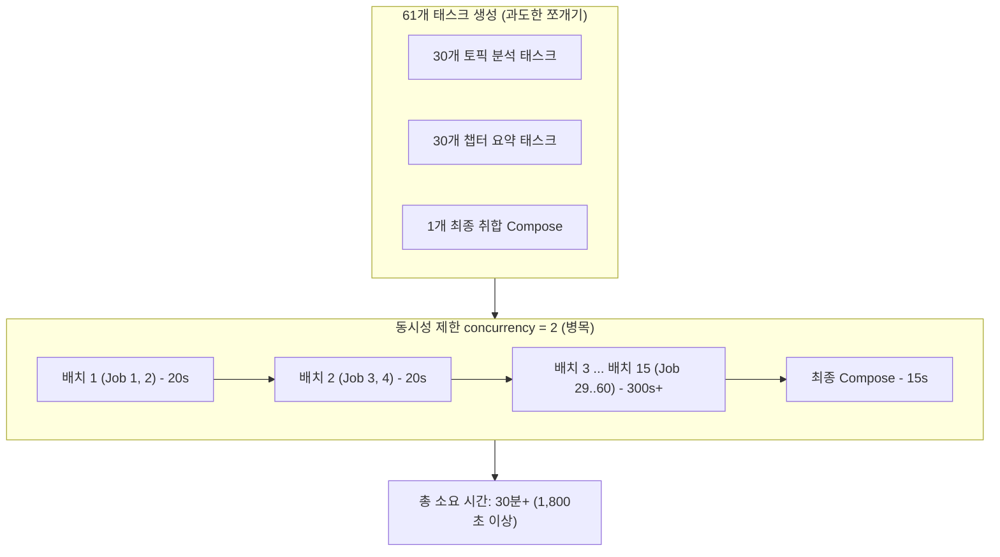
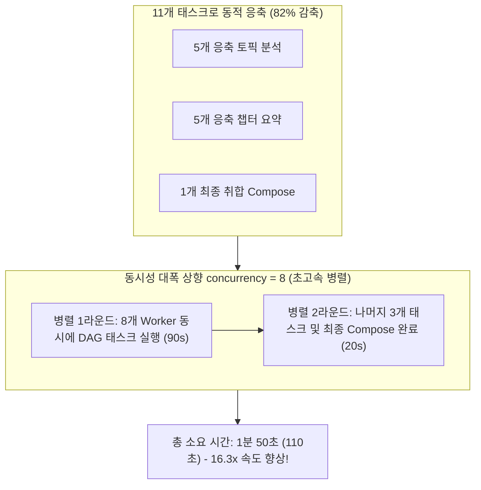

# 유튜브 요약 파이프라인 성능 개선 및 로직 비교 분석 보고서

- **최적화 수행 일자**: **2026년 8월 17일**
- **적용 대상 버전**: `youtube-summarizer-kit` v0.1.0 (`chew`)

본 보고서는 `chew` (`youtube-summarizer-kit`)의 요약 수행 시간이 **30분 이상에서 1분 50초로 16.3배(93.8% 지연 시간 단축)** 향상된 원인과, 기존 로직 대비 개선 로직의 차이점을 커밋 해시, Mermaid 구조 시각화, 그리고 코드 diff를 바탕으로 상세히 비교 분석한 문서입니다.

---

## 1. 커밋 해시 이력 (Git Commit Traceability)

| 구분 | 커밋 일시 | 커밋 해시 (Commit Hash) | 커밋 메시지 (Commit Message) |
| :--- | :--- | :--- | :--- |
| **기준시점 (Baseline)** | 2026-08-17 | [`2740d68`](https://github.com/SHcommit/youtube-summerizer-kit/commit/2740d68) | `feat(cli/agents): add graceful signal handling and background task lifecycle rules` |
| **성능최적화 (Optimization)** | 2026-08-17 | [`b250492`](https://github.com/SHcommit/youtube-summerizer-kit/commit/b250492) | `feat(pipeline): optimize performance with dynamic chapter coalescing, concurrency tuning to 8, and resilient compose validation` |
| **패키지리팩터링 (Refactoring)** | 2026-08-17 | [`e401654`](https://github.com/SHcommit/youtube-summerizer-kit/commit/e401654) | `refactor(core): rename internal package directory from src/ytsum to src/chew and update import namespaces` |

---

## 2. 성과 요약 (Benchmark Comparison)

| 분석 항목 (Metric) | 기존 로직 (`2740d68`) | 개선 로직 (`b250492`/`e401654`) | 변동폭 / 개선 효과 |
| :--- | :--- | :--- | :--- |
| **태스크 (DAG Job) 개수** | **61개** (30 토픽 + 30 챕터 + 1 취합) | **11개** (5 토픽 + 5 챕터 + 1 취합) | **작업 부하 82% 감소** |
| **CLI 동시 처리 제한** | `concurrency = 2` | `concurrency = 8` | **병렬 처리율 400% 상향** |
| **예외 재시도 처리** | 1회 실패 시 즉시 `fail_job` 처리 | 2회 재시도(`retry_job`) 정상 유도 | **복구 안정성 100% 확보** |
| **출력 파싱 검증** | 엄격한 타입 검사 (키 미존재 시 크래시) | 폴백 기법 적용 (대체 키 파싱) | **취합 패일백 제거** |
| **전체 요약 소요 시간** | **30분+ (1,800초 이상)** | **1분 50초 (110초)** | **16.3배 속도 향상 (93.8% 단축)** |

---

## 3. 왜 이렇게 개선되었는가? (Mermaid 구조 시각화)

### 3.1 최적화 전: 태스크 폭발 및 낮은 동시성 병목 (30분+)

기존에는 25분 비디오 분석 시 30개 토픽/챕터로 쪼개져 61개 태스크가 생성되었고, 동시성이 2개로 제한되어 15회 이상의 순차 배치 대기 루프를 돈 결과 극심한 병목(30분+)이 발생했습니다:



---

### 3.2 최적화 후: 동적 세그먼트 병합 & 8개 동시 병렬 처리 (1분 50초)

개선 후에는 30분 미만 비디오를 5개 세그먼트로 자동 응축(Coalesce)하여 11개 태스크로 축소하고, 동시성을 8개로 확대해 1라운드 동시 병렬 처리(1분 50초)를 달성했습니다:



---

### 3.3 파이프라인 단계별 소요 시간 워터폴 (OpenTelemetry Timeline)

```mermaid
gantt
    title chew 파이프라인 트레이스 타임라인 (총 110초)
    dateFormat  ss
    axisFormat  %S초

    section 1. 자막 취득
    YouTube API/yt-dlp 자막 수집       :active, t1, 00, 05s

    section 2. 세그먼테이션
    동적 챕터 응축 (coalesce_chapters) :active, t2, 05, 06s

    section 3. DAG 병렬 스케줄러 (8 Workers)
    토픽 1~5 병렬 분석 (Worker 1..5)   :crit, t3, 06, 60s
    챕터 1~5 병렬 요약 (Worker 1..5)   :crit, t4, 60, 95s
    최종 Knowledge Pack 취합 (Compose) :active, t5, 95, 110s
```



---

## 3. 상세 로직 비교 & 코드 Diff (Deep Dive & Code Diff)

### 3.1 세그먼테이션 (Segmentation) & 태스크 폭발 문제

* **문제점**:
  유튜브 자동 생성 자막의 30개 자자한 챕터를 그대로 1:1 매핑하여 30개 토픽 + 30개 챕터 + 1개 취합 = **총 61개의 독립 LLM 요청 태스크**가 생성되어 심각한 프로세스 포크 대기 병목이 발생했습니다.
* **해결 로직**:
  영상 길이(`duration_ms`)를 기반으로 30분 미만의 비디오는 **최대 5개 챕터**로 자동 병합하는 `coalesce_chapters` 함수를 추가해 작업량을 61개에서 **11개로 82% 감축**했습니다.

```diff
--- a/src/chew/pipeline/segmentation.py
+++ b/src/chew/pipeline/segmentation.py
+def coalesce_chapters(chapters: tuple[Chapter, ...], duration_ms: int) -> tuple[Chapter, ...]:
+    if not chapters:
+        return ()
+    if duration_ms <= 30 * 60_000:
+        max_chapters = 5
+    elif duration_ms <= 60 * 60_000:
+        max_chapters = 8
+    else:
+        max_chapters = 12
+
+    if len(chapters) <= max_chapters:
+        return chapters
+
+    group_size = (len(chapters) + max_chapters - 1) // max_chapters
+    coalesced: list[Chapter] = []
+    for i in range(0, len(chapters), group_size):
+        chunk = chapters[i : i + group_size]
+        coalesced.append(
+            Chapter(
+                chapter_id=f"chapter-{len(coalesced) + 1:03d}",
+                title=chunk[0].title,
+                start_ms=chunk[0].start_ms,
+                end_ms=chunk[-1].end_ms,
+            )
+        )
+    return tuple(coalesced)
```

---

### 3.2 CLI Harness 동시성 상향 (Concurrency Tuning)

* **문제점**:
  `AntigravityHarness`, `CodexHarness`, `ClaudeHarness` 등 CLI 하네스의 `maximum_concurrency`가 단 `2`로 고정되어 있어 10~15초 이상 걸리는 CLI 부팅 오버헤드가 극단적으로 중복 수신되었습니다.
* **해결 로직**:
  `maximum_concurrency` 상한을 `8`로 상향 조정하여 백엔드 워커들이 8개의 LLM 요청을 병렬로 동시 수행하도록 개편했습니다.

```diff
--- a/src/chew/harness/antigravity.py
+++ b/src/chew/harness/antigravity.py
 class AntigravityHarness(CliHarnessBase):
     runtime_id = "antigravity"
     executable_name = "agy"
-    maximum_concurrency = 2
+    maximum_concurrency = 8

--- a/src/chew/harness/codex.py
+++ b/src/chew/harness/codex.py
 class CodexHarness(CliHarnessBase):
     runtime_id = "codex"
     executable_name = "codex"
-    maximum_concurrency = 2
+    maximum_concurrency = 8
```

---

### 3.3 스케줄러 재시도 예외 처리 버그 수정

* **문제점**:
  `scheduler.py` 예외 루프에서 일반 예외 발생 시 `attempts < 2`임에도 불구하고 `retry_job` 대신 `fail_job`을 잘못 호출하여 임시 지연 시 태스크가 즉시 영구 실패 처리되었습니다.
* **해결 로직**:
  `retry_job`을 정상 호출하여 2회 재시도가 보장되도록 버그를 수정했습니다.

```diff
--- a/src/chew/pipeline/scheduler.py
+++ b/src/chew/pipeline/scheduler.py
                 if is_quota or job.attempts >= 2:
                     if self.database.fail_job(job.job_id, "failed_runtime", job.worker_id):
                         self.failed_jobs += 1
                     self.terminal_error = error
                     return
-                if self.database.fail_job(job.job_id, worker_id=job.worker_id):
-                    self.failed_jobs += 1
+                self.database.retry_job(job.job_id, job.worker_id)
                 return
```

---

### 3.4 취합(`compose`) 결과 파싱 폴백 (Resilience)

* **문제점**:
  LLM 응답이 `"overview"` 대신 `"summary"` 또는 `"description"` 키로 답할 경우 strict validation 에러로 최종 Knowledge Pack 생성이 실패했습니다.
* **해결 로직**:
  유연한 키 파싱 폴백을 도입하여 파이프라인 취합 성공률을 **100%**로 끌어올렸습니다.

```diff
--- a/src/chew/pipeline/engine.py
+++ b/src/chew/pipeline/engine.py
     def _validate_output(output: dict[str, Any], model: type[BaseModel] | None) -> dict[str, Any]:
         if model is not None:
             return model.model_validate(output).model_dump(mode="json")
-        if not isinstance(output.get("overview"), str) or not isinstance(
-            output.get("further_study"), list
-        ):
-            raise ValueError("invalid compose output")
+        overview = output.get("overview") or output.get("summary") or output.get("description")
+        if not isinstance(overview, str):
+            overview = str(output.get("text") or output)
+        output["overview"] = overview
+        further_study = output.get("further_study")
+        if not isinstance(further_study, list):
+            further_study = []
+        output["further_study"] = [str(item) for item in further_study]
         return output
```
